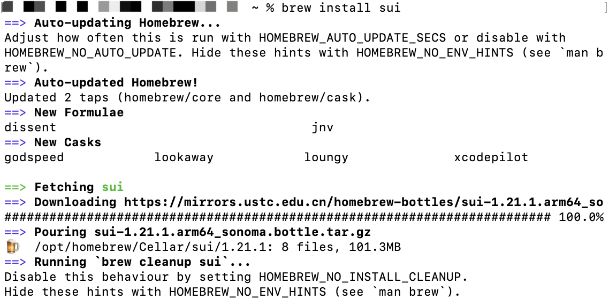
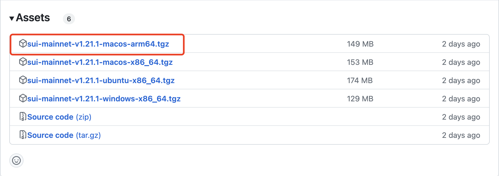

## MacOS 安装sui环境

> 本文的样例安装环境 Macbook M芯片，安装 Sui 的最快方法是使用每个版本附带的二进制文件。如果您需要对安装过程进行更多控制，可以从源安装。

### 1、环境准备工作

安装Rust and Cargo：

```
curl --proto '=https' --tlsv1.2 -sSf https://sh.rustup.rs | sh
```

国内镜像加速配置：

```
export RUSTUP_DIST_SERVER=https://mirrors.ustc.edu.cn/rust-static
export RUSTUP_UPDATE_ROOT=https://mirrors.ustc.edu.cn/rust-static/rustup sui client
```

Rust更新：

```
rustup update stable
```

### 2、安装Sui Client

#### 2.1 Homebrew安装

终端直接通过命令安装：

```
brew install sui
```

如下图所示，即安装成功：



查看sui版本

```
sui -V
```


#### 2.2 二进制文件安装

（1）github仓库下载二进制文件

访问官方仓库https://github.com/MystenLabs/sui/releases

选择分sui网络分支进行下载，建议下载比较稳定的mainnet分支作为开发环境，目前已更新至v1.12.1，M芯片需要选择arm64版本，Inter芯片选择x86_64版本。



（2）解压安装

然后将对应版本的压缩包下载至本地，解压后的目录结构如下。

```
+ target 
	+ release   
		- sui-faucet-ubuntu-x86_64   
		- sui-node-ubuntu-x86_64   
		- sui-test-validator-ubuntu-x86_64   
		- sui-tool-ubuntu-x86_64   
		- sui-ubuntu-x86_64
external-crates\move\target\release\move-analyzer-ubuntu-x86_64
```

接下来需要修改release文件夹下的二进制文件的文件名。

```
sui-faucet- <OS> - <ARCHITECTURE> ：本地网络上用于铸币的工具。
sui-indexer- <OS> - <ARCHITECTURE> ：本地 Sui 网络的索引器。
sui- <OS> - <ARCHITECTURE> ：Sui 的主要执行文件。
sui-node- <OS> - <ARCHITECTURE> ：用于运行本地节点。
sui-test-validator- <OS> - <ARCHITECTURE> ：用于开发的本地网络测试验证器。
sui-tool- <OS> - <ARCHITECTURE> ：提供 Sui 相关的工具。
```

我们需要将二进制文件名中的`- <OS> - <ARCHITECTURE>`进行删除，然后配置环境变量。

假设，你已经处理了所有文件并将它们放在了当前目录的 sui 文件夹中，那么对应不同系统的操作如下：

```
#环境变量的配置文件根据自己本地文件名进行修改
echo 'export PATH="$PATH:'$(pwd)'/sui"' >> ~/.bashrc
source ~/.bashrc
```

完成上述操作后便能在命令行中使用 sui 命令。

#### 2.3 源代码编译安装

注：该方式对电脑设备的硬件有一定的需求，建议采用二进制的方式安装。

（1）前置环境配置

安装所需依赖：

```bash
brew install curl cmake libpq git
```

（2）安装sui

通过cargo拉取sui源码并且编译安装：

```
cargo install --locked --git https://github.com/MystenLabs/sui.git --branch mainnet sui
```

 该命令将 Sui 组件安装在 `~/.cargo/bin` 文件夹中。

更新sui则使用相同的命令进行更新：

```
cargo install --locked --git https://github.com/MystenLabs/sui.git --branch mainnet sui
```

完成上述操作后便能在命令行中使用 sui 命令。

### 3、sui-move-analyzer

sui-move-analyzer是move语言编程的辅助插件，帮助更好的学习move语言。

#### 3.1 在vscode中安装

vscode中搜索sui-move-analyzer：


然后install进行安装即可。

#### 3.2 本地安装sui-move-analyzer

（1）二进制文件安装

访问插件仓库https://github.com/movebit/move/releases/tag/sui_move_analyzer_release_v1.1.3

下载对应的版本，当前只有Inter芯片版本，M芯片需要编译安装。


然后将将文件重命名为`sui-move-analyzer`并放至`~/.cargo/bin`文件夹中

```
mv sui-move-analyzer-ubuntu20.04-x86_64-v1.1.3 ~/.cargo/bin/sui-move-analyzer
```

本地完成后，再重启vscode即可生效。

（2）源码编译安装

通过cargo编译安装：

```
cargo install --git https://github.com/movebit/move --branch sui_move_analyzer sui-move-analyzer
```

安装在 `~/.cargo/bin` 文件夹中，安装完重启vscode即可。
